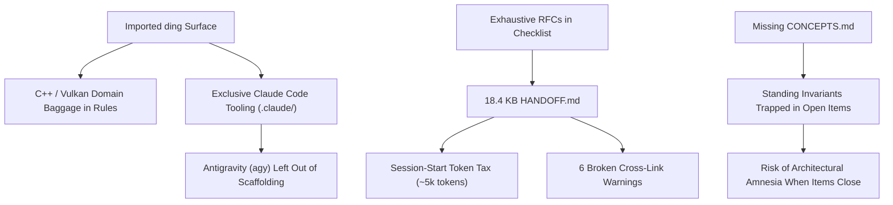

# Documentation & Workflow Structure Deep Analysis: `htui`

**Date:** 2026-09-03  
**Target Repository:** `htui` (`D:\projects\htui`)  
**Upstream Reference Workspace:** `ding` / `dingine` (`D:\projects\ding`)  
**Synced Surface Status:** Synced directly from `../ding` via `sync-workflow-surface.ps1` (22 surface files identical).  
**Core Artifacts Analyzed:**
- [`HANDOFF.md`](file:///D:/projects/htui/HANDOFF.md)
- [`.claude/rules/concept-docs.md`](file:///D:/projects/htui/.claude/rules/concept-docs.md)
- [`.claude/rules/workflow-docs.md`](file:///D:/projects/htui/.claude/rules/workflow-docs.md)
- [`.claude/skills/handoff-docs.md`](file:///D:/projects/htui/.claude/skills/handoff-docs.md)
- Supporting subsystem: `.claude/skills/handoff-run/`, `.claude/skills/handoff-add/`, `.claude/skills/graphify/`, `DECISIONS.md`, and upstream `../ding/CONCEPTS.md`

---

## 1. Executive Summary & Context

`htui` is an independent Rust project created to build a Terminal User Interface that wraps AI coding agents (`claude`, `agy`) to manage multi-repo, multi-box workflows.

Following the synchronization of the workflow surface from `../ding` (`sync-workflow-surface.ps1`), `htui` now carries the exact same 22-file workflow infrastructure as the parent `dingine` workspace.

### The Central Finding: A Teleological Paradox
There is an acute meta-circular relationship between the workflow surface and `htui`:
1. **The Scaffolding is the Target:** `htui` exists specifically to replace, automate, and centralize the very markdown/script-driven handoff mechanism (`/handoff-run`, `/handoff-add`, `validate-workflow-docs.ps1`, `next-item.ps1`) that it has just imported from `ding`.
2. **Context Budget Lesson Learned by Upstream (`ding`):** As recorded in upstream `ding`'s commit `389d548` and `references/ecosystem-survey.md`, the author previously disabled the ECC plugin because loading unused agent/skill descriptions burned ~69,000 characters of context per session just to use four files. **Yet `htui`'s own `HANDOFF.md` is currently committing this exact same error:** embedding 18.4 KB (~5,000 tokens) of dense RFC and DDL specifications directly into its session-start checklist.
3. **Correctness Verdict:**
   * **Temporarily Sound as a Bootstrap Rig:** For Day-0 item sequencing and dependency resolution before `htui` is compiled, the structure works deterministically.
   * **Architecturally Defective without Adaptation:** Without domain sanitization, file size discipline, a project-specific `CONCEPTS.md`, and multi-agent parity for `agy`, the imported structure actively works against `htui`'s product goals.

---

## 2. In-Depth Audit of the Core Files

### 2.1 `HANDOFF.md` (The Active Backlog)

#### What Works
* **Strict Priority & Block Graph:** Explicit markers like `blocked on local MOD-1` and `unblocks 3` allow `next-item.ps1` to compute candidate rankings deterministically (currently ranking `ANA-1` as top priority, unblocking 3 items).
* **Clear Task Types:** Clear partitioning between open analyses (`ANA-N`) and implementation modules (`MOD-N`).

#### What Is Broken
1. **Gross Violation of Size and Summary Rules:**  
   `.claude/rules/workflow-docs.md` (lines 30–32) mandates:
   > *"HANDOFF.md/DECISIONS.md only ever summarize an ANA; the detail stays in the docs/ANA-N.md file itself and isn't duplicated."*  
   In `htui`, `HANDOFF.md` is **18,435 bytes** across 223 lines. Items `ANA-1` through `ANA-6` contain complete RFCs, architectural debate verdicts, and DDL sketches directly inside the checklist bullet points.
2. **Validator Warnings on Every Run:**  
   Because `HANDOFF.md` points to `docs/ANA-1.md` through `docs/ANA-6.md`, but none of these files actually exist on disk, running `validate-workflow-docs.ps1` outputs **6 warnings**:
   ```
   [WARNING] cross-link: HANDOFF.md: linked path not found: docs/ANA-1.md
   ...
   [WARNING] cross-link: HANDOFF.md: linked path not found: docs/ANA-6.md
   workflow-docs validation: 0 error(s), 6 warning(s) in D:\projects\htui
   ```
3. **Session-Start Token Tax:**  
   Because agents read `HANDOFF.md` first at session start, every agent turn pays a steep token fee to ingest long architectural specifications that are only relevant to one specific task.
4. **Fragility of Regex-Based Dependency Parsing:**  
   As recently uncovered in `ding` (commit `d344d20`, `TOOL-14`), regex parsing of `blocked on ...` in `next-item.ps1` has no negation guard (e.g. an item stating "not blocked on MOD-21" is falsely parsed as blocked, causing cycle deadlocks). This real-world bug proves the necessity of `htui`'s planned `item_link` SQL edge table over regex-grepped markdown.

---

### 2.2 `.claude/rules/concept-docs.md` & The Missing `CONCEPTS.md`

#### What Works
* The temporal categorization (Past = `DECISIONS.md`, Present = `CONCEPTS.md`, Future = `HANDOFF.md`) is brilliant and enforces clear documentation boundaries.
* The 6,144 byte size cap enforces high information density.

#### What Is Broken
1. **Unsanitized C++ Engine Baggage:**  
   The rule file contains literal copy-paste text from `ding`:
   * Line 19: References why the *"RHI seam exists"* (Rendering Hardware Interface).
   * Line 44: Forbids CMake target-dependency tables because *"the CMake target graph is extracted, not written"*.
   * Lines 74–88: References `engine/din/vfs`, `workspace MOD-14`, and `engine MOD-33`.  
   In a Rust TUI project managing subprocesses and terminal state, these references are irrelevant noise that confuses LLMs into searching for C++ constructs.
2. **The "Ghost Rule" Problem:**  
   While `concept-docs.md` exists and is loaded automatically by Claude, **there is no `CONCEPTS.md` in `htui`**.
3. **Loss of Standing Invariants:**  
   Crucial architectural invariants already settled for `htui` currently live exclusively in `HANDOFF.md` checklist text:
   * **Storage Hierarchy:** Postgres is canonical for state; OneDev (if retained) is canonical for human discussion; `items.json` is a derived offline snapshot.
   * **Transcript Scrubbing:** Secret-scrubbing must run locally on the box before any transcript or attachment leaves the machine.
   * **Prompt Economy:** Prompts must inline skills directly; agents must run with system skills disabled and never spend turns reading skill files.
   * **Graph Simplicity:** Traversal uses recursive SQL CTEs over `item_link`, explicitly rejecting graph database overhead.  
   Once `ANA-1` and `ANA-2` are completed and deleted from `HANDOFF.md`, these standing truths will be buried in historical decision write-ups unless placed in a root `CONCEPTS.md`.

---

### 2.3 `.claude/rules/workflow-docs.md`

#### What Works
* Strict minting discipline: ID calculation is file-derived and offline; raw grep minting is forbidden.
* Reverse-chronological, linked table of contents in `DECISIONS.md`.

#### What Is Broken
1. **Prefix Irrelevance (`VAL-N`):**  
   The rule defines `VAL-N` as:
   > *"Runtime validation finding (VUID / validation-layer error caught via run-target.ps1)"*  
   This is 100% Vulkan graphics API specific. In `htui`, runtime validation findings will be terminal ANSI rendering glitches, async tokio worker deadlocks, or ACP JSON-RPC desyncs.
2. **Impedance Mismatch with Centralized Storage:**  
   The rule assumes that sequential integer IDs (`MOD-1`, `ANA-2`) scoped per-file are the only identifiers. `htui`'s architecture introduces UUIDs in Postgres. The rule provides no model for how UUIDs map to file-scoped sequential IDs during multi-box synchronization.

---

### 2.4 `.claude/skills/handoff-docs.md` & The `/handoff-*` Tooling

#### What Works
* Strict human-in-the-loop gating: Maintainers confirm selection, routing, plan fact-checks, and review gates.
* Multi-stage pipeline: PRD → Plan → Fact-Check → Implement → Review → Close-out.

#### What Is Broken
1. **Agent Monoculture (`claude` vs. `agy`):**  
   The entire skill surface is built exclusively for Claude Code (`.claude/skills/`, slash commands like `/handoff-run`, Sonnet 5 subagents).  
   `htui`'s stated objective is to wrap **both Claude Code and Antigravity (`agy`)**. Antigravity cannot run `.claude/skills/` natively, meaning `agy` cannot participate in the dogfooding workflow using this toolset.
2. **Prompt-Budget Contradiction:**  
   `HANDOFF.md` (ANA-2) states:
   > *"skill-injection contract: agents run with system skills disabled — htui owns the skill text and inlines it into the initial prompt directly, so behavior is identical on every box and the agent never spends turns reading skill files."*  
   Yet `/handoff-run` in Claude forces the agent to read `SKILL.md` (14 KB), `references/selection.md` (7 KB), `references/routing.md` (5 KB), and `references/lifecycle.md` (5.5 KB), wasting 30+ KB of context per run.
3. **Heavy Script Maintenance:**  
   The dual `.ps1` / `.sh` scripts (over 70 KB combined) exist solely because Windows hangs on bash fork (`0xC0000142`). In `htui`, these utilities should be compiled directly into the Rust binary (`htui-cli`).

---

## 3. Comparative Architecture Matrix

| Dimension | Upstream Scaffolding (`ding` / `.claude/`) | `htui` Current State | `htui` Target State (MOD-1..7) |
|---|---|---|---|
| **Primary Domain** | C++26 graphics engine (`engine/`, Vulkan) | Pre-code Rust TUI specifications | Cross-platform Rust TUI & multi-agent harness |
| **State Storage** | Monolithic Markdown (`HANDOFF.md`) in git | Monolithic Markdown (18.4 KB) | Postgres canonical + thin `items.json` + OneDev |
| **Active Rules** | `concept-docs.md`, `workflow-docs.md` | Exact copy of `ding` rules | Rust-tailored rules + native TUI validators |
| **Standing Concepts** | Active `CONCEPTS.md` (3.9 KB) | **Missing** (invariants trapped in backlog) | Native `CONCEPTS.md` (<6 KB) |
| **Backlog Hygiene** | Summaries only; details in `docs/ANA-*.md` | **Violated**: 18.4 KB backlog, missing ANA docs | Thin `items.json` or slim <5 KB `HANDOFF.md` |
| **Agent Support** | Claude Code only | Claude Code only (via `.claude/`) | Full parity: Claude Code (`claude`) & Antigravity (`agy`) |
| **Agent Protocol** | Slash commands & subagents | Manual / Claude Code slash commands | ACP (Agent Client Protocol) or streamed CLI (`ANA-4`) |
| **Orchestration** | Shell scripts (`next-item.ps1`, `handoff-run`) | Identical shell scripts | Rust TUI step-graph state machine (`MOD-4`) |
| **Skill Delivery** | Agent reads `.claude/skills/` on demand | Agent reads `.claude/skills/` on demand | Inlined into prompt by `htui`; system skills disabled |

---

## 4. Root Causes of Friction



1. **Premature Convergence in Backlog:** Treating `HANDOFF.md` as both an issue tracker and a design document.
2. **Template Rigidity across Repositories:** Enforcing that every sub-repo in the developer's universe share identical `VAL-N` prefixes and C++ engine references.
3. **Platform Workarounds:** Duplicating 70 KB of PowerShell and Bash scripts to avoid Windows subprocess bugs instead of leveraging Rust's native speed and reliability.

---

## 5. Phased Improvement Roadmap

### Phase 1: Immediate Scaffolding Hygiene (Zero Code Required)

1. **Extract `docs/ANA-1.md` through `docs/ANA-6.md` (P0):**
   * Move the comprehensive design proposals out of `HANDOFF.md` and into their own files under `docs/`.
   * Replace the checklist entries in `HANDOFF.md` with concise 3-to-4 line summaries pointing to `docs/ANA-N.md`.
   * *Outcome:* Slashes `HANDOFF.md` by ~70% (to <5 KB), eliminates all 6 validator warnings, and cuts session-start token consumption.
2. **Author `CONCEPTS.md` at Repository Root (P0):**
   * Create `CONCEPTS.md` (staying under the 6,144 byte cap) containing `htui`'s standing invariants:
     * **System Identity:** Agent-wrapping TUI harness, not an IDE or terminal emulator.
     * **Data Layer:** Postgres is canonical; `items.json` is a lightweight derived snapshot; recursive SQL CTEs for item dependency graphs.
     * **Prompt Economy:** Skills are inlined by `htui` at invocation; agents never read skill files; linked item summaries are injected (max 1–2 hops).
     * **Security:** Transcripts scrubbed of secrets on the local machine before upload.
   * *Outcome:* Anchors architectural decisions permanently before `ANA-1` through `ANA-6` are archived.
3. **Sanitize Rule Files (P1):**
   * Edit `.claude/rules/concept-docs.md` to remove all CMake, RHI, and `dingine` references; tailor examples to Rust, `cargo`, and TUI components.
   * Edit `.claude/rules/workflow-docs.md` to redefine `VAL-N` for TUI rendering glitches, async worker panics, and IPC desyncs. Remove mentions of `engine/din/vfs`.
4. **Establish Antigravity (`agy`) Parity (P1):**
   * Add agent guidelines ensuring Antigravity can operate against `HANDOFF.md` and `DECISIONS.md` without depending on Claude-specific slash commands.

### Phase 2: Hybrid Bridge (During MOD-1 through MOD-6)

1. **Build `HANDOFF.md` Parser into `htui` (`MOD-1`):**
   * Ensure `htui` can parse the markdown `HANDOFF.md` format immediately so that `htui` can manage its own backlog from day one.
2. **Compile Workflow Utilities into Native Rust (`MOD-1` / `MOD-6`):**
   * Replace `validate-workflow-docs.ps1` and `next-item.ps1` with native `htui` CLI subcommands (e.g. `htui check`, `htui next`, `htui mint`). This eliminates all cross-platform shell script maintenance.
3. **Implement the `items.json` Coexistence Bridge (`MOD-6`):**
   * Build two-way synchronization between the local working tree snapshot (`items.json`) and the central Postgres database.

### Phase 3: Native Self-Hosting (Target State)

1. **Retire `.claude/skills/handoff-run`:**
   * Transition execution from the Claude skill to the `htui` application. The developer selects an item in the TUI, tracks the step-graph execution, and interacts via the streaming chat tab.
2. **Activate the Native Skill-Injection Engine:**
   * `htui` dynamically builds the prompt for Claude or Antigravity, inlining exact instructions and box quirks while disabling external agent skills.
3. **Transform Markdown into Derived Views:**
   * `HANDOFF.md` becomes an exported, read-only view for GitHub/OneDev viewing, while Postgres remains the sole transactional source of truth.

---

## 6. Action Checklist

- [ ] **P0:** Move ANA-1..6 text from `HANDOFF.md` into `docs/ANA-1.md` through `docs/ANA-6.md`.
- [ ] **P0:** Shorten `HANDOFF.md` checklist items to 3-line summaries with links.
- [ ] **P0:** Create `CONCEPTS.md` at root with standing invariants.
- [ ] **P1:** Remove C++/Vulkan/CMake references from `.claude/rules/concept-docs.md` and `.claude/rules/workflow-docs.md`.
- [ ] **P1:** Redefine `VAL-N` in `.claude/rules/workflow-docs.md` for Rust/TUI runtime validation.
- [ ] **P1:** Add instructions/guidance for Antigravity (`agy`) compatibility.
- [ ] **P2:** Implement native Rust parser for `HANDOFF.md` in `htui` (`MOD-1`).
- [ ] **P3:** Replace `.claude/skills/handoff-run` with `htui` TUI orchestrator (`MOD-4`).
